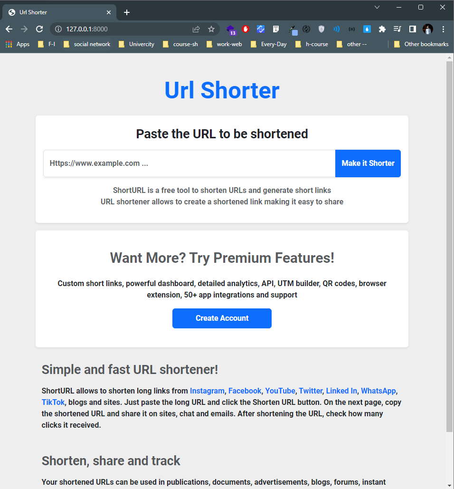
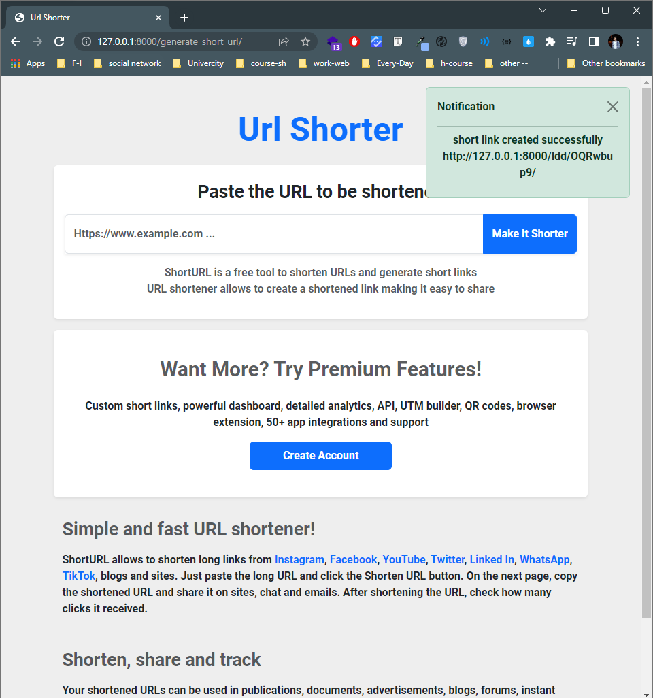

# django-url-shorter
simple django url Shorter web app

# How to use:

### create  virtual environment:
    
    python -m venv venv
    or 
    python3 -m venv venv

activate Virtual Enviroment:

      ./venv/Scripts/activate
      or 
      source .\venv\Scripts\activate

install dependencies:

        pip install -r requirements.txt
        or 
        pip3 install -r requirements.txt

Migrate db and Run server:

      python manage.py migrate
      python manage.py runserver

